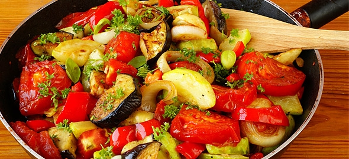

# Tourlou

Tourlou, written *τουρλού* in greek, or *türlü* in the neighbour Turkey, is a food made of various different summer vegetables. When used twice, as *τουρλού τουρλού*, it obtains the metaphorical meaning of an irregural, usually unmatched, crowded mix of people or artifacts.

I started working on an OpenStack project some months ago and not having been part of a DevOps team before, I used to hear a looot of new words, or terms I had come across with, but never searched their exact meaning. In order fill the gap between my dev knowledge and the admin territory, I came up with a practical solution: I created a list in my smartphone and every time I was hearing a new term, I wrote it down. When I had free time, I would google my words; sometimes more and sometimes less thoroughly. But I did not write anything down, something I later regretted. In this post I will save all the terms I search, no matter how irrelevant they may be with each other, no matter how imperfect or subjective they may be.
