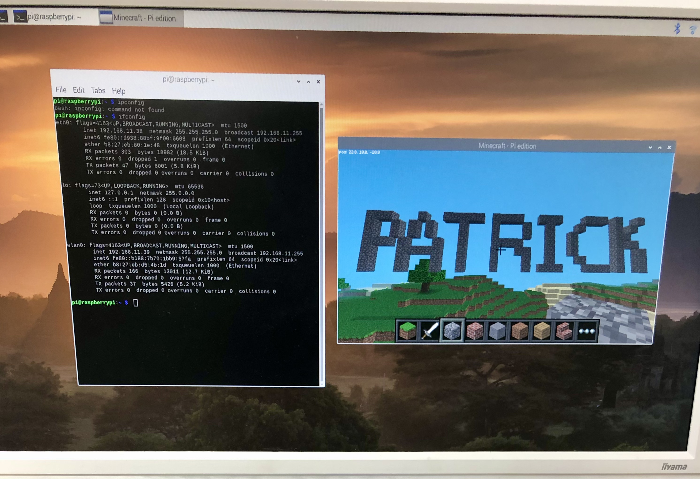
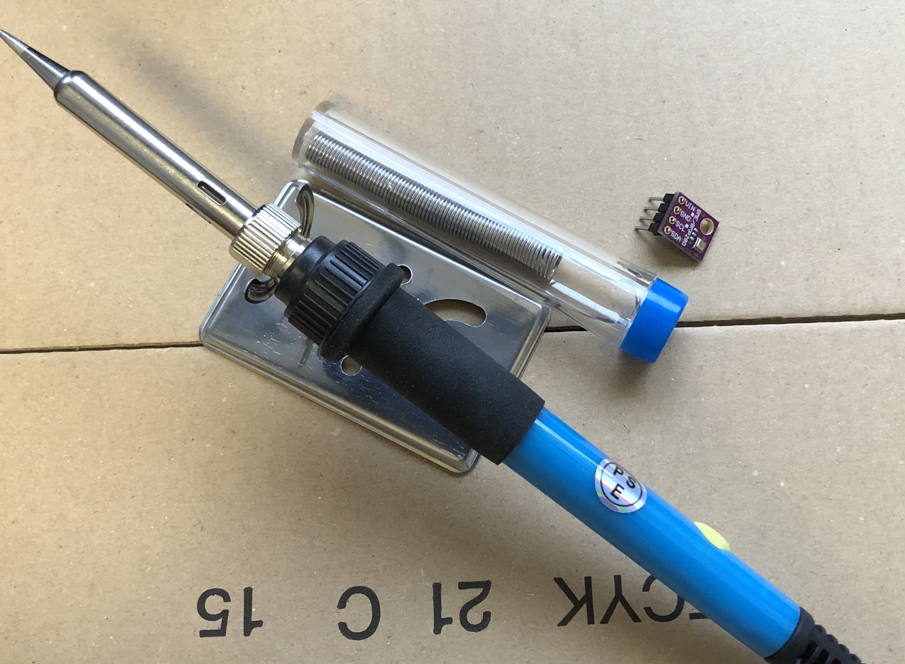
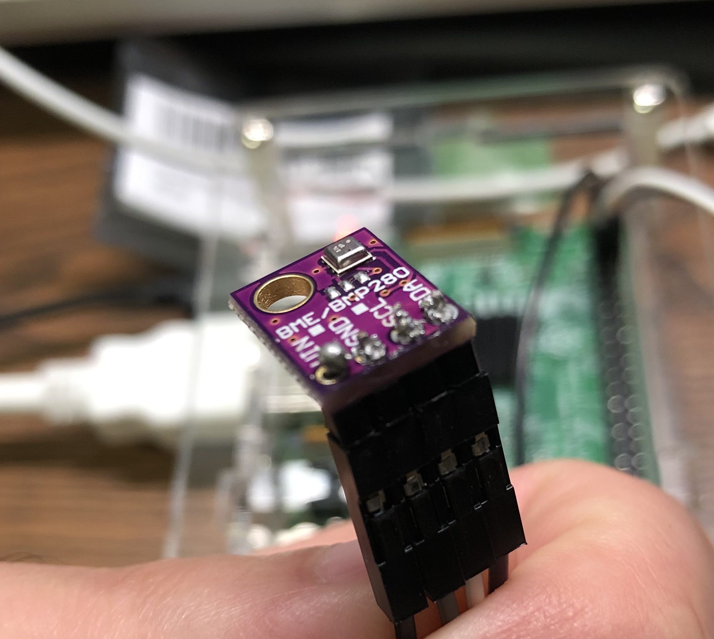

**Updated Date: 2021/3/23**

### Background

Atmospheric chemistry laboratory has certain requirements for temperature, humidity and pressure.
In order to be able to record environmental information for a long period of time as well as to monitor the
current environmental conditions in real time, a data manager and environmental information monitor is going 
to be built using a lab stock Raspberry Pi 3B.


### Purpose

Use Raspberry Pi 3B to build a real time environmental information monitor and data manager that can save
environmental information for a long period of time. 

### Hardware

1. Host: Raspberry Pi Model B
2. Sensor: VKLSVAN BME280



**Updated Date: 2021/3/27**

### Hardware assembly

Sensor BME280 needs to be soldered to the pins.



This was my first time using a soldering gun, and the solder did not look very good, but successfully connected the circuit.



Before constructing a graphical dashboard, I need to test the if the sensor is soldered proporply. 

Instructions followed: https://www.mikan-tech.net/entry/raspi-bme280

Download the packages via terminal:

```
$ sudo raspi-config nonint do_i2c 0
$ sudo apt install python3-pip
$ pip3 install adafruit-circuitpython-bme280
```
Then check via python3 order:

```
$ python3
>>> import adafruit_bme280
>>> import board,  busio
>>> import time
>>> i2c = busio.I2C(board.SCL, board.SDA)
>>> bme280 = adafruit_bme280.Adafruit_BME280_I2C(i2c, address=0x76)
>>> print(bme280.temperature)
21.239322265941883
>>> print(bme280.relative_humidity)
50.69910585087109
>>> print(bme280.pressure)
1003.5124021075654
>>> exit()
```

The temperature, relative humidity and pressure data were successfully read out and the circuit was successfully assembled.
